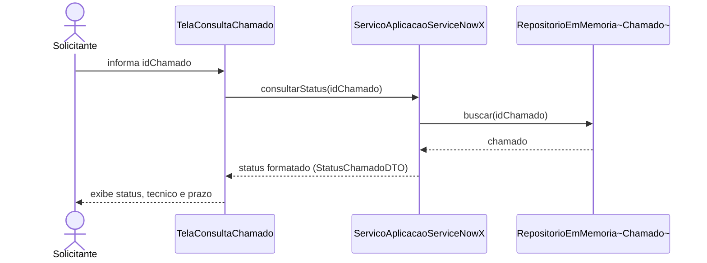

# 5.2 Diagrama de sequência

1- O Solicitante informa o número do chamado (idChamado) para a TelaConsultaChamado — é o ponto de entrada da interação.
2- A tela não faz nenhuma regra sozinha: ela apenas repassa o pedido chamando consultarStatus(idChamado) no ServicoAplicacaoServiceNowX. Isso reforça a responsabilidade já definida no projeto — regra de negócio fica no serviço, não na interface.
3- O serviço busca o chamado no RepositorioEmMemoria, que devolve o objeto Chamado (com status, técnico e prazo já salvos internamente).
4- O serviço monta a resposta formatada e a devolve para a tela.
5- A tela, por fim, exibe o resultado ao solicitante.