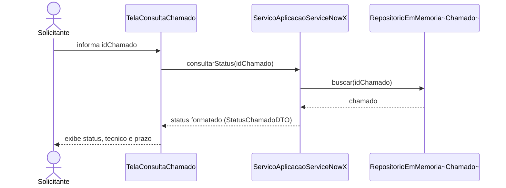

# Diagrama de sequência

```mermaid
sequenceDiagram
    actor Solicitante
    participant Tela as TelaConsultaChamado
    participant Servico as ServicoAplicacaoServiceNowX
    participant Repo as RepositorioEmMemoria~Chamado~

    Solicitante->>Tela: informa idChamado
    Tela->>Servico: consultarStatus(idChamado)
    Servico->>Repo: buscar(idChamado)
    Repo-->>Servico: chamado
    Servico-->>Tela: status formatado (StatusChamadoDTO)
    Tela-->>Solicitante: exibe status, tecnico e prazo
```