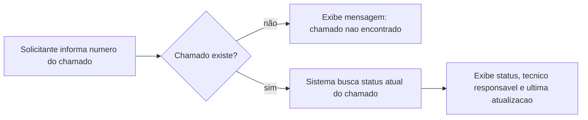

# Fluxo do usuário

- **Caminho principal:** chamado existe → status é encontrado e exibido.
- **Caminho alternativo:** número de chamado inexistente → mensagem de erro.
- **Início:** solicitante informa o número do chamado (ex.: `INC001`).
- **Fim:** solicitante entende a situação atual do atendimento.

---